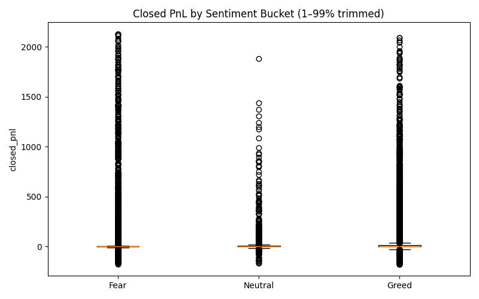
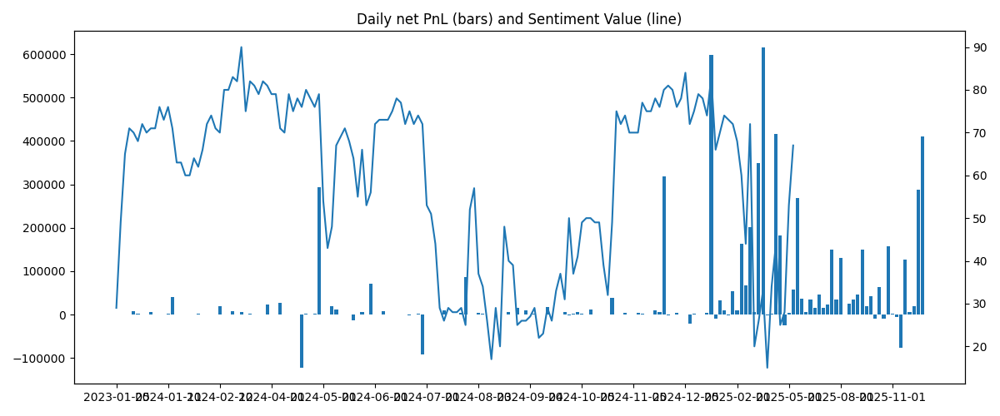

-> Trader Sentiment Analysis

This project analyzes how cryptocurrency trader performance changes under different market sentiment conditions (Fear vs Greed).

The analysis combines:

1. Bitcoin Fear & Greed Index
2. Historical trader activity dataset

Goal:
Understand how sentiment influences trading performance and risk behavior.
## Visual Analysis

### Trader PnL Distribution by Sentiment

This chart shows how trader profit and loss varies across different market sentiment periods.

---

### Daily PnL vs Market Sentiment

This visualization compares daily profit trends during fear and greed market phases.

---

### Sentiment Distribution

This chart shows the overall distribution of market sentiment across the dataset.
